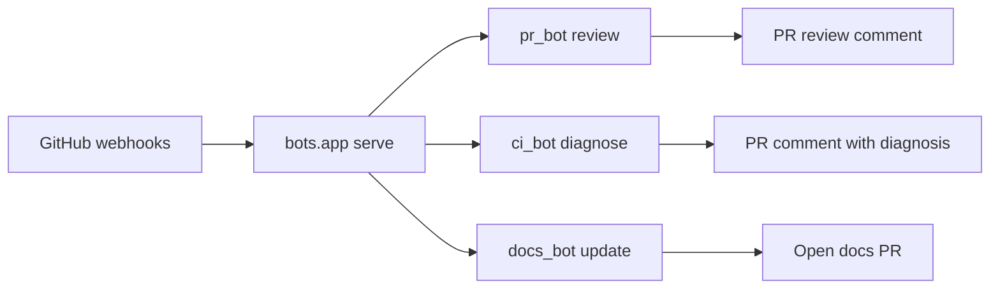

# Architecture

This document describes the structure of **agent-delegation-fun**. Update it when a PR changes how components connect, what agents exist, or how data flows between them.

## Overview

Local Python agents triggered by GitHub webhooks or CLI. Each agent uses pydantic-ai + Claude to analyze context and act on the repo.

## Packages

| Package | Trigger | Action |
|---|---|---|
| `pr_bot/` | `pull_request` opened | Post code review comment on PR |
| `ci_bot/` | `workflow_run` failed | Fetch CI logs, post diagnosis comment on PR |
| `docs_bot/` | `pull_request` opened | If docs changed, open PR updating architecture and/or README |
| `bot_shared/` | — | Shared LLM client, GitHub auth, git ops |
| `bots/` | — | Unified FastAPI webhook server |
| `casino/` | — | Blackjack simulator (unrelated demo app) |

## Webhook server

Single entrypoint: `python -m pr_bot.main serve` → `bots.app:app`

| Event | Handler |
|---|---|
| `pull_request` / `opened` | PR review + docs check |
| `workflow_run` / `completed` + failure | CI diagnosis comment |

## Configuration

Environment variables (see `.env.example`):

- `ANTHROPIC_API_KEY`, `ANTHROPIC_WORKSPACE_ID` — Claude
- `GITHUB_TOKEN` — fetch PRs, post reviews/comments, push docs branches, open docs PRs (requires `repo` + `actions:read` + `contents:write` scopes)
- `PR_BOT_MODEL` — optional model override

## Docs bot scope

The docs agent watches for changes that need **architecture** or **README** updates:

- New agents or packages
- Changed webhook flows, triggers, or CLI commands
- New external integrations
- Renamed or removed major components
- User-facing setup or project description changes

It updates `docs/architecture.md` for structural changes and `README.md` for user-facing project info. It does **not** update docs for routine internal changes with no documentation impact.
